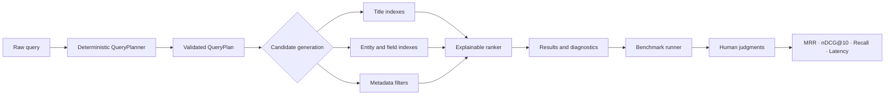

# CineSeek

**Understand how search works. Explore autocorrect. Tune the ranking yourself.**

CineSeek is an interactive playground for anyone curious about what happens
between typing a query and seeing results. Search **9,742 MovieLens titles**,
inspect how your words are interpreted, and change ranking weights to see why
some movies rise above others.

**The product idea is simple: make search easier to understand by letting people
experiment with its moving parts.** A familiar movie catalogue gives abstract
concepts—like spelling similarity, phrase matching, and relevance—a concrete
place to explore.

[What you can explore](#what-you-can-explore) · [Try an experiment](#try-an-experiment) ·
[Product decisions](#product-decisions-and-tradeoffs) · [Run locally](#five-minute-local-setup)


[](LICENSE)


## What you can explore

| Question | What CineSeek makes visible |
| --- | --- |
| **How does search understand my query?** | Follow how words become title matches, genres, entities, filters, and sorting instructions. |
| **How does autocorrect work?** | Inspect spelling corrections, the entity they apply to, and the planner's confidence. Explore how context affects interpretation. |
| **Why did this movie rank higher?** | See the contribution of matching words, word order, phrases, proximity, spelling similarity, and rating signals. |
| **What happens if I change the weights?** | Adjust ranking controls and compare the resulting order and score breakdowns. |
| **Did my change make search better?** | Explore benchmark metrics and, in local mode, review relevance judgments across different queries. |

The playground is for learners, developers, product managers, and anyone who
has wondered why a search engine returned a particular result. You can start
with a query and a few controls, then go deeper into the planner, scoring, and
evaluation as your curiosity grows.

## Try an experiment

After [starting CineSeek locally](#five-minute-local-setup), follow a simple
learning loop: **search → inspect → change a weight → compare**.

1. **Explore query understanding.** Compare `horror movies` with
   `title contains horror`. Inspect how the same word can become a genre
   constraint or part of a title search.
2. **Investigate a typo.** Try a misspelled movie title and inspect the query
   understanding panel. Check whether a correction was applied and examine the
   explanation. With optional TMDB enrichment, try a person query such as
   `tom cuise` too.
3. **Change what matters in ranking.** Search for a title with several words.
   Increase the phrase bonus, then try changing token coverage or edit
   similarity. Compare the result order and individual score contributions.
4. **Explore genre ranking.** Search `comedy` and experiment with genre
   centrality, rating quality, and rating-count evidence. Inspect how each
   signal contributes to the results.

Changing a weight may leave the order unchanged for some queries. The score
breakdown helps explain when a signal matters and when other signals dominate.

## Why the product is designed this way

Search combines several decisions that are usually hidden behind a single
input box. CineSeek turns those decisions into things people can inspect and
control. The intended learning outcome is to help someone explain **how a query
was understood, why a result appeared, and what changed after an adjustment**.

Three priorities shape the experience:

- **Make concepts tangible.** Use movies and recognizable queries to connect
  search mechanics to results people can reason about.
- **Make experimentation explainable.** Put ranking controls alongside score
  evidence so people can connect an adjustment to its effect.
- **Support deeper investigation.** Use the same planner and retrieval pipeline
  for interactive search and benchmarks, letting a single-query experiment
  lead into broader evaluation.

## Product decisions and tradeoffs

| Decision | Product rationale | Tradeoff |
| --- | --- | --- |
| **Start with deterministic query planning.** | Let people follow each interpretation step and reproduce the same experiment. | Rules have limited language coverage; an LLM planner remains a planned comparison. |
| **Keep intent and constraints distinct.** | Treat `horror movies` as genre discovery, `title contains horror` as title search, and year or rating requirements as filters. | Contextual routing needs explicit cases and ongoing evaluation. |
| **Preserve separate evidence for each field.** | Distinguish title, person, genre, tag, and overview matches so people can understand why a movie appears. | Broader discovery depends on metadata coverage and optional enrichment. |
| **Use ratings as supporting evidence.** | Require at least five ratings before an average can influence ranking; apply Bayesian adjustment and keep rating count separate. | Popularity and rating signals cannot substitute for human relevance judgments. |
| **Make human review part of the product.** | Preserve unjudged candidates and flag disagreements for adjudication. | Reliable evaluation requires reviewer effort; generated labels remain provisional. |
| **Keep hosted access read-only.** | Share search, diagnostics, and benchmark evidence through a bounded public deployment. | Collaborative editing requires authentication and transactional persistence. |

## Measuring search quality

The committed benchmark provides an initial baseline across **82 queries**.
These are warm local runs with **generated, provisional relevance judgments**;
they establish a regression baseline, not validated user impact.

| Question | Measure | Committed result |
| --- | --- | ---: |
| Do relevant candidates enter the result pool? | Candidate recall | 81.10% |
| How early does the first relevant result appear? | MRR | 0.3500 |
| How well are the top results ordered? | nDCG@10 | 0.3525 |
| How responsive is the search pipeline? | Warm p95 end-to-end latency | 71.03 ms |
| Did every benchmark query produce a run? | Missing query runs | 0 |

Use these metrics to explore a second question after changing the weights:
**did the results improve across different searches, or just the one you tried?**
The labels are incomplete, so reliable comparisons require human review.
These figures measure the search pipeline; they do not establish how much
people learn from using CineSeek.

Source: [committed benchmark summary](frontend/data/benchmark-summary.json).
See the [review protocol](benchmark/README.md) for how provisional labels should
be validated.

## Priorities and current boundaries

Future work can extend what people can explore while keeping comparisons
meaningful. These are proposed directions, not shipped capabilities.

1. **Establish a reviewed relevance baseline.** Complete human grading and
   adjudication, then publish a separate reviewed split. The existing 82-query
   set remains provisional; genre review is in progress.
2. **Compare approaches against that baseline.** Evaluate deterministic versus
   LLM query planning and explore semantic candidate retrieval. Current
   retrieval is lexical, field-aware, and metadata-aware; semantic and hybrid
   vector retrieval are not yet implemented.
3. **Enable shared operation.** Add production authentication, role-based
   authorization, and transactional persistence before supporting concurrent
   editing. Write-capable review and parser-test routes are currently local-only.

Actor, director, overview, and poster coverage depends on an optional TMDB
enrichment run. Filesystem persistence supports local workflows; it does not
provide concurrent, distributed production storage.

## Architecture



The webpage and benchmark call the same `QueryPlanner`. Retrieval consumes a
validated `QueryPlan` without reinterpreting raw language. This boundary makes
it possible to compare a future LLM planner while holding candidate generation
and ranking constant.

## Five-minute local setup

Requirements: Node.js 24+, Python 3.11+, npm, and an internet connection for
the official MovieLens download.

```bash
cd cineseek
node frontend/scripts/bootstrap.mjs
cd frontend
npm run dev
```

Open [http://localhost:3000](http://localhost:3000). The bootstrap command
installs Python and Node dependencies, downloads and transforms MovieLens,
builds entity and planner indexes, creates the parser workbook, and generates
the frozen provisional run used by the review UI.

### Base mode

Base mode requires no credentials. It supports title and genre search, tags,
ratings, structured filters, ranking diagnostics, entities, benchmarks, and
evaluation.

### Local benchmark writes

Benchmark editing and review-pool writes are disabled by default. Enable them
only for local development by adding these values to `frontend/.env.local`:

```env
CINESEEK_DEPLOYMENT_MODE=local
CINESEEK_ALLOW_BENCHMARK_WRITES=true
```

Do not add `CINESEEK_ALLOW_BENCHMARK_WRITES` to Vercel or any hosted
environment.

### Optional TMDB enrichment

Copy `frontend/.env.local.example` to `frontend/.env.local`, add your own
`TMDB_READ_TOKEN` or `TMDB_API_KEY`, then run:

```bash
cd frontend
npm run enrich:tmdb:corpus
npm run build:enriched-corpus
npm run build:entities
npm run dev
```

This adds actors, directors, overviews, and poster paths to the local build.
Enrichment snapshots are intentionally ignored by Git.

## Common commands

Run these from `frontend/` unless noted otherwise.

| Command | Purpose |
| --- | --- |
| `npm run dev` | Start the local webpage |
| `npm run test:title-index` | Run planner, retrieval, ranking, and benchmark unit tests |
| `npm run test:tmdb` | Run enrichment and poster-path tests using source-owned fixtures |
| `npm run workbook:parser-cases:verify` | Verify parser workbook cases against the production planner |
| `npm run benchmark:title` | Run the 82-query production pipeline benchmark |
| `npm run benchmark:actions-summary -- <report.json>` | Render an evaluator report as a GitHub Actions summary |
| `npm run benchmark:generic-genre` | Build the focused, unjudged `comedy` ranking pool and evidence report |
| `npm run benchmark:summary` | Regenerate the UI benchmark summary from an evaluator report |
| `npm run lint` | Run ESLint |
| `npm run format:check` | Verify Prettier formatting |
| `npm run build` | Create the production Next.js build |
| `npm run scan:secrets` | Scan public source files for common credential patterns |
| `python -m pytest` | Run Python corpus and evaluator tests from the repository root |

The `Evaluation metrics` GitHub Actions workflow rebuilds the public-data search
pipeline after every push to `main`, publishes the provisional relevance and
latency metrics in the run summary, and retains the full run and report for 30
days. It can also be started manually from the Actions tab.

## Vercel deployment

CineSeek supports a public, read-only Vercel deployment backed by an immutable
private Blob data release. Search, query planning, entities, diagnostics, and
benchmark evidence remain available; public benchmark writes and AI spending
are disabled. See [the Vercel deployment guide](docs/VERCEL.md) for data release,
environment, Preview verification, and rollback instructions.

## Repository map

```text
benchmark/              Project-owned queries, qrels, and review protocol
docs/                   Brand, data policy, and portfolio media
frontend/app/           Next.js product and server routes
frontend/lib/           Shared planner, retrieval, ranking, and review logic
frontend/scripts/       Bootstrap, indexing, enrichment, and benchmark tools
src/cineseek/           Python dataset and evaluation package
tests/                  Python tests
```

Generated datasets, caches, reports, registries, private reviews, and Next.js
build output are ignored. A clean checkout recreates them through the bootstrap
command.

## Data and licensing

MovieLens and TMDB-derived data are not included in this repository and are not
covered by the code license. See [docs/DATA.md](docs/DATA.md) for the data policy
and source links.

> This product uses TMDB and the TMDB APIs but is not endorsed, certified, or
> otherwise approved by TMDB.

CineSeek source code is available under the [MIT License](LICENSE). Third-party
datasets, metadata, and media retain their own terms.
