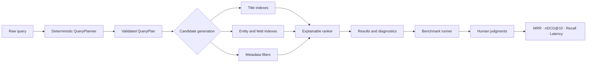

# CineSeek

**Explainable movie discovery, from query understanding to relevance evaluation.**


[](LICENSE)

CineSeek is a movie-search product and relevance workbench built over 9,742
MovieLens titles. It makes the normally hidden parts of search—correction,
intent, routing, candidate generation, scoring, and judgments—inspectable and
editable.

## Why this exists

A plausible search result is not necessarily a good answer. A query such as
`romantic comedy`, `tom cuise`, or `1990s crime movies with at least 100 ratings`
requires different interpretation, retrieval, and ranking choices. CineSeek
turns those choices into a product surface: you can see what the system
understood, inspect why a result scored, alter weights, and evaluate the impact
against a shared benchmark.

The goal is not to imitate a streaming catalogue. It is to show how a search
system can be understandable to product teams while remaining measurable for
relevance engineers.

## Product capabilities

- **Unified query planner** — one server-side, typed plan handles normalization,
  contextual spelling correction, intent, entities, filters, routing, and sort.
- **Entity-aware retrieval** — titles, actors, directors, genres, tags, and
  optional overviews remain distinguishable evidence rather than one opaque
  text field.
- **Structured filters** — year, minimum rating, rating count, genre, and sort
  constraints are separated from title scoring.
- **Explainable ranking** — inspect token coverage, order, phrase, proximity,
  trigram, edit-distance, field, rating, and genre-focus contributions.
- **Evaluation workbench** — edit queries and qrels, run the production planner,
  and compare MRR, nDCG@10, recall, and latency.
- **Human relevance review** — build frozen pools, grade candidates on a 0–3
  scale, preserve unjudged states, and flag disagreements for adjudication.

## Architecture



The webpage and benchmark call the same `QueryPlanner` and retrieval pipeline.
Retrieval consumes a validated `QueryPlan`; it does not reinterpret raw
language. That boundary also supports a future LLM planner comparison without
changing candidate generation or ranking.

## Product decisions and tradeoffs

**Deterministic before generative.** Rules and scores are traceable, fast, and
repeatable. An LLM planner is a planned comparison implementation, not a hidden
replacement for the current logic.

**Genre and title are contextual.** `horror movies` routes Horror as a genre;
`title contains horror` keeps the same word in the title route; `Horror of
Dracula` can retain title evidence plus a lower-priority genre fallback.

**Metadata constraints are not title words.** A year range or rating-count
constraint filters candidates instead of improving lexical similarity.

**Rating is evidence, not truth.** A movie needs at least five ratings before
its average rating can influence ranking. Eligible averages use Bayesian
adjustment, while rating count remains separate evidence. Human grades remain
authoritative.

**The benchmark is provisional.** Generated qrels are useful regression guards,
not complete ground truth. The review workflow exists precisely because a
single expected title can misrepresent discovery quality.

## Measured evidence

The current committed summary is generated from the 80-query provisional split
using warm local runs over MovieLens Latest Small:

| Metric | Current result |
| --- | ---: |
| Candidate recall | 0.8063 |
| MRR | 0.3151 |
| nDCG@10 | 0.3187 |
| Warm p95 end-to-end latency | 101.03 ms |
| Missing query runs | 0 |

These values are evidence of the current implementation, not a claim of
production search quality. The judgments are incomplete and some categories
have sparse labels. See [`benchmark/README.md`](benchmark/README.md) for the
review protocol and [`frontend/data/benchmark-summary.json`](frontend/data/benchmark-summary.json)
for the UI source artifact.

## Five-minute local setup

Requirements: Node.js 24+, Python 3.11+, npm, and an internet connection for
the official MovieLens download.

```bash
cd cineseek
node frontend/scripts/bootstrap.mjs
cd frontend
npm run dev
```

Open [http://localhost:3000](http://localhost:3000). The bootstrap command
installs Python and Node dependencies, downloads and transforms MovieLens,
builds entity and planner indexes, creates the parser workbook, and generates
the frozen provisional run used by the review UI.

### Base mode

Base mode requires no credentials. It supports title and genre search, tags,
ratings, structured filters, ranking diagnostics, entities, benchmarks, and
evaluation.

### Local benchmark writes

Benchmark editing and review-pool writes are disabled by default. Enable them
only for local development by adding these values to `frontend/.env.local`:

```env
CINESEEK_DEPLOYMENT_MODE=local
CINESEEK_ALLOW_BENCHMARK_WRITES=true
```

Do not add `CINESEEK_ALLOW_BENCHMARK_WRITES` to Vercel or any hosted
environment.

### Optional TMDB enrichment

Copy `frontend/.env.local.example` to `frontend/.env.local`, add your own
`TMDB_READ_TOKEN` or `TMDB_API_KEY`, then run:

```bash
cd frontend
npm run enrich:tmdb:corpus
npm run build:enriched-corpus
npm run build:entities
npm run dev
```

This adds actors, directors, overviews, and poster paths to the local build.
Enrichment snapshots are intentionally ignored by Git.

## Common commands

Run these from `frontend/` unless noted otherwise.

| Command | Purpose |
| --- | --- |
| `npm run dev` | Start the local webpage |
| `npm run test:title-index` | Run planner, retrieval, ranking, and benchmark unit tests |
| `npm run test:tmdb` | Run enrichment and poster-path tests using source-owned fixtures |
| `npm run workbook:parser-cases:verify` | Verify parser workbook cases against the production planner |
| `npm run benchmark:title` | Run the 80-query production pipeline benchmark |
| `npm run benchmark:actions-summary -- <report.json>` | Render an evaluator report as a GitHub Actions summary |
| `npm run benchmark:generic-genre` | Build the focused, unjudged `comedy` ranking pool and evidence report |
| `npm run benchmark:summary` | Regenerate the UI benchmark summary from an evaluator report |
| `npm run lint` | Run ESLint |
| `npm run format:check` | Verify Prettier formatting |
| `npm run build` | Create the production Next.js build |
| `npm run scan:secrets` | Scan public source files for common credential patterns |
| `python -m pytest` | Run Python corpus and evaluator tests from the repository root |

The `Evaluation metrics` GitHub Actions workflow rebuilds the public-data search
pipeline after every push to `main`, publishes the provisional relevance and
latency metrics in the run summary, and retains the full run and report for 30
days. It can also be started manually from the Actions tab.

## Vercel deployment

CineSeek supports a public, read-only Vercel deployment backed by an immutable
private Blob data release. Search, query planning, entities, diagnostics, and
benchmark evidence remain available; public benchmark writes and AI spending
are disabled. See [the Vercel deployment guide](docs/VERCEL.md) for data release,
environment, Preview verification, and rollback instructions.

## Repository map

```text
benchmark/              Project-owned queries, qrels, and review protocol
docs/                   Brand, data policy, and portfolio media
frontend/app/           Next.js product and server routes
frontend/lib/           Shared planner, retrieval, ranking, and review logic
frontend/scripts/       Bootstrap, indexing, enrichment, and benchmark tools
src/cineseek/           Python dataset and evaluation package
tests/                  Python tests
```

Generated datasets, caches, reports, registries, private reviews, and Next.js
build output are ignored. A clean checkout recreates them through the bootstrap
command.

## Current limitations and roadmap

- Complete human-reviewed judgments are available only through an in-progress
  genre review workflow; the 82-query qrels remain provisional.
- Retrieval is primarily lexical, field-aware, and metadata-aware. Semantic or
  hybrid vector retrieval has not yet been implemented.
- Optional actor, director, overview, and poster coverage depends on the user's
  TMDB enrichment run.
- Write-capable benchmark and parser-test routes are local-only. Production
  authentication and role-based authorization are planned separately.
- Filesystem persistence is suitable for a local build, not concurrent or
  distributed production operation.

Next steps are reviewed relevance splits, deterministic-versus-LLM query-plan
evaluation, semantic candidate retrieval, production authentication, and
transactional persistence.

## Data and licensing

MovieLens and TMDB-derived data are not included in this repository and are not
covered by the code license. See [docs/DATA.md](docs/DATA.md) for the data policy
and source links.

> This product uses TMDB and the TMDB APIs but is not endorsed, certified, or
> otherwise approved by TMDB.

CineSeek source code is available under the [MIT License](LICENSE). Third-party
datasets, metadata, and media retain their own terms.
